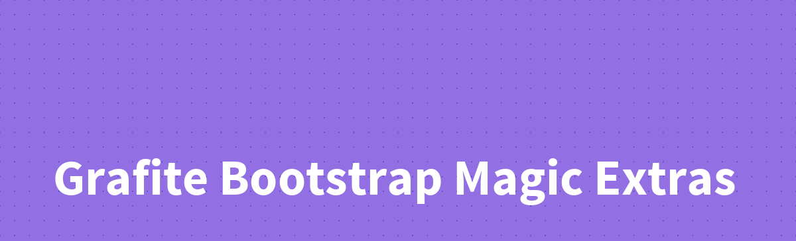

## Why?

A great question you may find yourself asking is why do this at all? There is tailwind and there are lots of parts built into Bootstrap already. Its true that Tailwind is great, howver I predominantly use Bootstrap and its utlities are lacking. This collection of animations, utities, and small bonus pieces are all built around Bootstrap's variables ensuring that anything added follows suit with the standard Bootstrap feel. This to me covers 95% of the needed aspects of designing and making any modern website.

##### Author(s):
* [Matt Lantz](https://github.com/mlantz) ([@mattylantz](http://twitter.com/mattylantz), mattlantz at gmail dot com)

## Requirements

1. Bootstrap 4.5+

### Installation

Start a new Laravel project:
```php
npm install @grafite/bootstrap-magic-extras
```

## Sources

All animations have been sourced from [animate.css](https://github.com/animate-css/). Original credit and authorship should be given to their team. I simply wanted a select few of these animations without the overhead of having another package in my projects.

Most utilities are heavily inspired by [Tailwind](https://tailwindcss.com). Though their package is significant and well designed, and I enjoy the scope of their utilities, I'd prefer to stick with Bootstrap and its components and simply gain more utilities to the core of Bootstrap.

## Documentation

[https://docs.grafite.ca/utilities/bmx](https://docs.grafite.ca/utilities/bmx)

## License
Grafite Charts is open-sourced software licensed under the [MIT license](http://opensource.org/licenses/MIT)

### Bug Reporting and Feature Requests
Please add as many details as possible regarding submission of issues and feature requests

### Disclaimer
THE SOFTWARE IS PROVIDED "AS IS", WITHOUT WARRANTY OF ANY KIND, EXPRESS OR IMPLIED, INCLUDING BUT NOT LIMITED TO THE WARRANTIES OF MERCHANTABILITY, FITNESS FOR A PARTICULAR PURPOSE AND NONINFRINGEMENT. IN NO EVENT SHALL THE AUTHORS OR COPYRIGHT HOLDERS BE LIABLE FOR ANY CLAIM, DAMAGES OR OTHER LIABILITY, WHETHER IN AN ACTION OF CONTRACT, TORT OR OTHERWISE, ARISING FROM, OUT OF OR IN CONNECTION WITH THE SOFTWARE OR THE USE OR OTHER DEALINGS IN THE SOFTWARE.
